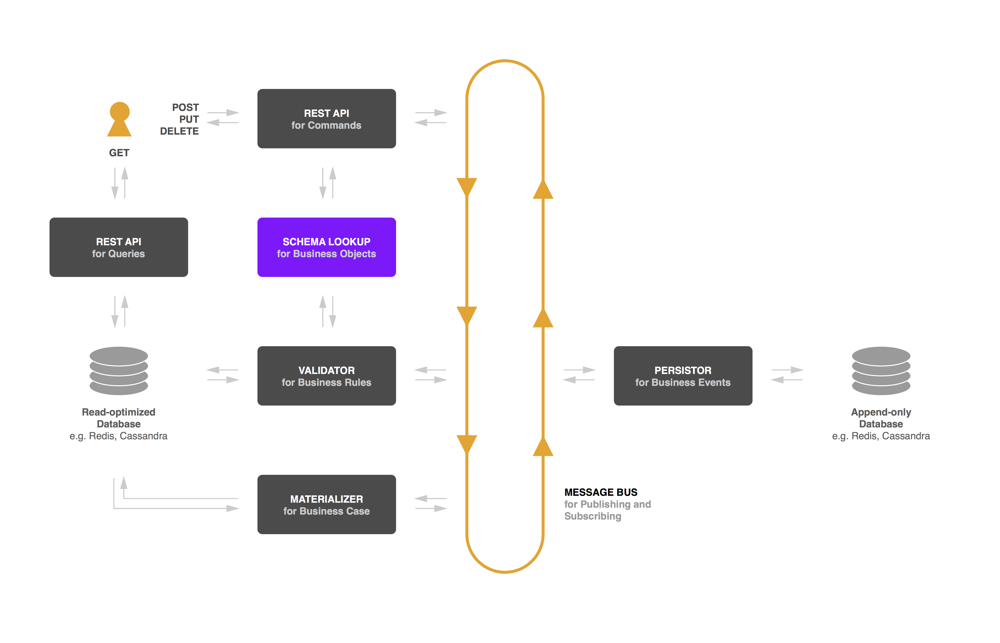
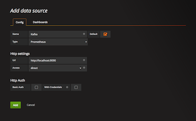
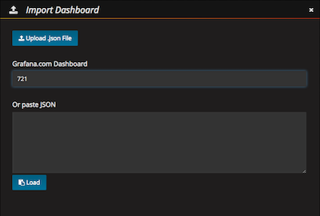
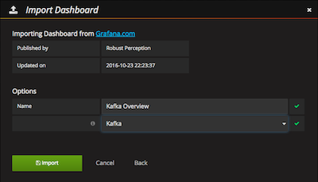
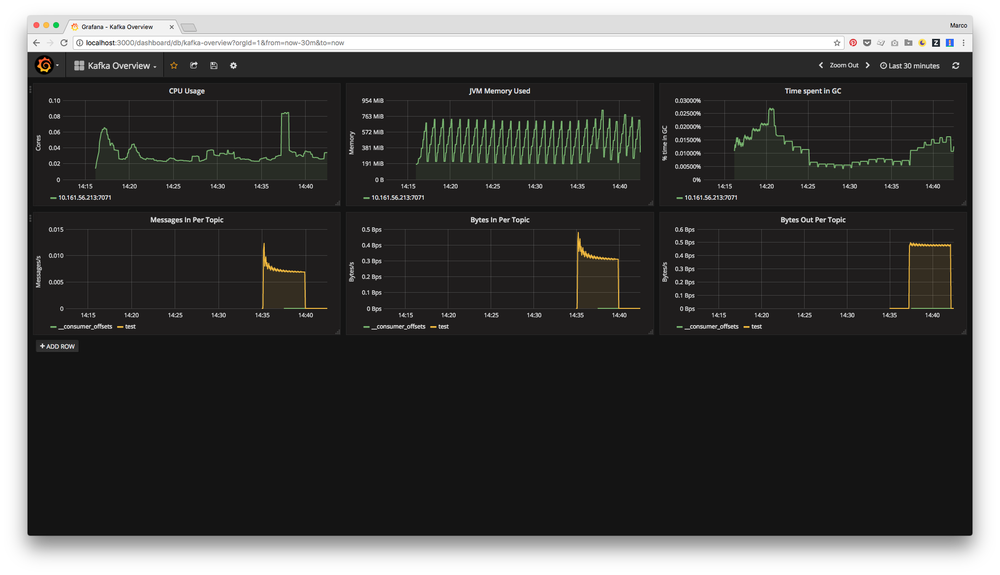

# PoC for an event log driven system

## Overview



## Services

The PoC uses [Kafka](https://kafka.apache.org/) as message bus, [Prometheus](https://prometheus.io/) as monitoring and alerting toolkit, [Grafana](https://grafana.com/) for time series analytics and two [Redis](https://redis.io/) instances as key-value store for snapshots and events.

> Anecdote: “Prometheus” was written by “Kafka, Franz” as you can read [here](https://en.wikipedia.org/wiki/Prometheus_(short_story)).

### Local IP address

It’s very important to mention that all the scripts rely on determine the local IP address. As this is not possible with one platform agnostic command it’s retrieved by using `$ ipconfig getifaddr en0` for Mac users and `$ hostname -I` for Linux users.

### Docker

Docker daemon must run to build the image using `./control.sh build`. Check if it is running like this:

```bash
$ docker version
Client:
 Version:      17.09.1-ce
 API version:  1.32
 Go version:   go1.8.3
 Git commit:   19e2cf6
 Built:        Thu Dec  7 22:22:25 2017
 OS/Arch:      darwin/amd64

Server:
 Version:      17.09.1-ce
 API version:  1.32 (minimum version 1.12)
 Go version:   go1.8.3
 Git commit:   19e2cf6
 Built:        Thu Dec  7 22:28:28 2017
 OS/Arch:      linux/amd64
 Experimental: true
```

If the daemon is not running it responds with an error like this:

> Error response from daemon: Bad response from Docker engine

### Control

```bash
$ ./control.sh setup
Setting up dependencies and config files …
  dependency "jmx_prometheus_javaagent-0.6.jar" was downloaded
  config file "kafka-0-8-2.yml" was downloaded
  config file "prometheus.yml" was created
  config file "settings.json" was created

$ ./control.sh build
Building docker image …
  image "m99coder-tpc/kafka:0.10.2.0" built

$ ./control.sh start
Stopping services …
  service "zookeeper" stopped
  service "kafka" stopped
  service "prometheus" stopped
  service "grafana" stopped
  service "redis-snapshots" stopped
  service "redis-events" stopped
Cleaning containers …
  container "zookeeper" removed
  container "kafka" removed
  container "prometheus" removed
  container "grafana" removed
  container "redis-snapshots" removed
  container "redis-events" removed
Building docker image …
  image "m99coder-tpc/kafka:0.10.2.0" built
Starting services …
  using IP 10.161.56.213
  service "zookeeper" started
  service "kafka" started
  service "prometheus" started
  service "grafana" started
  service "redis-snapshots" started
  service "redis-events" started

$ ./control.sh status
Status …
  using IP 10.161.56.213

zookeeper
  ID: c7c7097f2ee5c82feb767b4e99cfd5731bdb481260d3402f7e78bcad66590663
  Image: zookeeper:3.4
  IP Address: 172.17.0.2
  Ports: map[3888/tcp:[{0.0.0.0 3888}] 2181/tcp:[{0.0.0.0 2181}] 2888/tcp:[{0.0.0.0 2888}]]

kafka
  ID: 7362e56f00f71877f63ab409644b6d5877821ab01ad6d96e6e9d0ae5c21ce31e
  Image: m99coder-tpc/kafka:0.10.2.0
  IP Address: 172.17.0.3
  Ports: map[7071/tcp:[{0.0.0.0 7071}] 7203/tcp:[{0.0.0.0 7203}] 9092/tcp:[{0.0.0.0 9092}]]

prometheus
  ID: 53a08c38e35ba96021048b2cfd64ad60ffa94cdbf06dc75eb431c97b753cb808
  Image: prom/prometheus:v1.6.3
  IP Address: 172.17.0.4
  Ports: map[9090/tcp:[{0.0.0.0 9090}]]

grafana
  ID: ab29fb1e848393463381576cdba1a442424caa80c04c555365132f274d1aaa12
  Image: grafana/grafana:4.3.1
  IP Address: 172.17.0.5
  Ports: map[3000/tcp:[{0.0.0.0 3000}]]

redis-snapshots
  ID: 594e9c0431eaf1530d3c54eb997970492dfd37c9a215510d17bbb8fe8b585130
  Image: redis:3.2.9
  IP Address: 172.17.0.6
  Ports: map[6379/tcp:[{0.0.0.0 6379}]]

redis-events
  ID: 6ba1ce6fa3a0d02a3c75cfe712caa61bd7b60b5675f7184fdf53fea0a970b258
  Image: redis:3.2.9
  IP Address: 172.17.0.7
  Ports: map[6379/tcp:[{0.0.0.0 6380}]]

$ ./control.sh stop
Stopping services …
  service "zookeeper" stopped
  service "kafka" stopped
  service "prometheus" stopped
  service "grafana" stopped
  service "redis-snapshots" stopped
  service "redis-events" stopped
Cleaning containers …
  container "zookeeper" removed
  container "kafka" removed
  container "prometheus" removed
  container "grafana" removed
  container "redis-snapshots" removed
  container "redis-events" removed
```

### Monitoring

Using [ches/kafka](https://github.com/ches/docker-kafka) and [Monitoring Kafka with Prometheus](https://www.robustperception.io/monitoring-kafka-with-prometheus/) as a base.

#### JMX Exporter

If system is running the metrics are exported to [http://localhost:7071/metrics](http://localhost:7071/metrics) by [JMX Exporter](https://github.com/prometheus/jmx_exporter). Additionally it’s possible to view JMX metrics using `$ jconsole 10.161.56.213:7203`.

#### Prometheus

Prometheus is listening on [http://localhost:9090](http://localhost:9090). Be aware that your local IP address has to be used in `prometheus.yml`.

#### Grafana

Grafana is listening on [http://localhost:3000](http://localhost:3000). Default credentials are `admin:admin`.

Configuration steps

1. Add a prometheus data source  
  [](./assets/grafana-1-add-data-source.png)
2. Import the [Kafka Overview](https://grafana.com/dashboards/721) dashboard and configure the previously added data source.  
  [](./assets/grafana-2-import-dashboard.png)  
  [](./assets/grafana-3-configure-dashboard.png)

#### Testing

```bash
$ # Creating topics
$ docker run -it --rm m99coder-tpc/kafka:0.10.2.0 kafka-topics.sh --create --topic test --zookeeper $(ipconfig getifaddr en0):2181 --replication-factor 1 --partitions 1
Created topic "test".

$ # List topics
$ docker run -it --rm m99coder-tpc/kafka:0.10.2.0 kafka-topics.sh --list --zookeeper $(ipconfig getifaddr en0):2181
test

$ # Delete topics
$ docker run -it --rm m99coder-tpc/kafka:0.10.2.0 kafka-topics.sh --delete --topic test --zookeeper $(ipconfig getifaddr en0):2181
Topic test is marked for deletion.
Note: This will have no impact if delete.topic.enable is not set to true.

$ # Producing messages
$ # Please be aware that the validator can only handle commands created by Command REST API
$ docker run -it --rm m99coder-tpc/kafka:0.10.2.0 kafka-console-producer.sh --topic test --broker-list $(ipconfig getifaddr en0):9092
This is a message
Message 2
Hello, world!
^C

$ # Consuming messages
$ docker run -it --rm m99coder-tpc/kafka:0.10.2.0 kafka-console-consumer.sh --topic test --from-beginning --bootstrap-server $(ipconfig getifaddr en0):9092
This is a message
Message 2
Hello, world!
^CProcessed a total of 3 messages
```



#### Connect to running containers

```bash
$ docker exec -it zookeeper /bin/bash
$ docker exec -it kafka /bin/bash
$ docker exec -it prometheus /bin/sh
$ docker exec -it grafana /bin/bash
```

### Command REST API

To use the Command REST API execute `$ node command-api/server.js` which starts a server listening to `http://localhost:4000` by default. It provides endpoints for `/entries` and `/assets` supporting create, update and delete of entities. It also validates if the given body satisfy the schema defined in `settings.json`. If this check passes a command is published to Kafka and processed by the validator.

For sake of simplicity within the PoC an HTTP request like that:

```
POST /entries/c987af87-6183-4ee6-8989-d7f38d1f15e2 HTTP/1.1
Host: localhost:4000
Content-Type: application/json

{
  "title": "My Entry",
  "src": "http://s3.aws.com/1.png",
  "description": "This describes my entry pretty well."
}
```

is transformed to a command message with the following format:

```json
{
  "type": "updateEntry",
  "body": {
    "title": "My Entry",
    "src": "http://s3.aws.com/1.png",
    "description": "This describes my entry pretty well."
  },
  "params": {
    "id": "c987af87-6183-4ee6-8989-d7f38d1f15e2"
  },
  "meta": {
    "user": 1
  }
}
```

Currently only these atomic commands are supported:

* `createEntry`, `updateEntry`, `deleteEntry`
* `createAsset`, `updateAsset`, `deleteAsset`

### Validator

To start the validator execute `$ node validator/server.js` which creates a Kafka Consumer for the `commands` topic and processes all received commands. Therefore it validates them according to given schema and to certain business rules by querying the Redis snapshot instance.

If you see the message `The topic(s) commands do not exist` stop the validator and start it again. The reason for that is that topic creation takes a [little](https://github.com/SOHU-Co/kafka-node/issues/111) while and if you start the scripts in parallel the validator might be too fast.

### Persister

To start the persister execute `$ node persister/server.js`.

### Materializer

To start the materializer execute `$ node materializer/server.js`.

### Query REST API

To use the Query REST API execute `$ node query-api/server.js`.
